The website doesn't use lazy loading for each image, instead of loading them one by one, it loads them all at once. it makes my CPU work hard just for one browser tab.
There are wallpapers available for mobile on the Taiwan (tw) and Chinese (cn) servers, but not for the global server. You can also use two modes, that is non-concurrency or concurrency mode. using concurrency mode are so fast and will download all wallpapers in concurrently (async) without waiting for each image to finish downloading (sync).

### Visit official site

- global : https://aethergazer.com/gallery
- cn: https://skzy.ys4fun.com/main/wallpapers/
- tw: https://www.aethergazer.tw/main/

### Demo

- concurrency downlad mode
- no need install any modules :).
- average wallpaper size are so big. so, you can stop and continue anytime.
- it will skip if alrdy downloaded.
- all downladed wallpaper saved in <currentdir>/AgWallpaper<server>.

## License

This project is licensed under the [MIT License](LICENSE).
